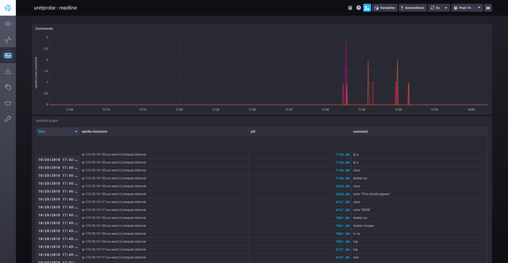

# InfluxDB eBPF Example

This project contains a program written in Go that uses [gobpf](http://github.com/iovisor/gobpf) to load an eBPF program containing an uprobe into the target system's kernel.

The eBPF program, is executed directly in kernel space and it gives back data to user space using
a BPF table that is then consumed to send the data to an InfluxDB backend where the data can be analyzed and plotted in nice graphs.


This example is based on the [bash_readline.go](https://github.com/iovisor/gobpf/blob/master/examples/bcc/bash_readline/bash_readline.go) program from the gobpf examples.

See [main.go](main.go) for more details, the source code is heavily commented so that you can understand it.

## Usage

This example was designed to be executed in a Kubernetes cluster so that you can visualize all the bash commands
executed in our nodes.

To deploy it in your cluster.

```bash
// Clone the repo and cd into it, then
$ kubectl create namespace monitoring
$ kubectl apply -f deploy.yml
```

Now you can SSH into some of your nodes and start executing commands in a bash prompt.

Once you have this, you will have to reach the chronograf service in the monitoring namespace
and open it in your browser.
You can do that using an ingress, a proxy or an SSH tunnel.

Then when you open Chonograf you can import the dashboard in `dashboard.json`.

The dashboard will look like this:

If you'd like to see a video demo of this project, look [here](https://www.youtube.com/watch?v=5iXXFG6yu00)



