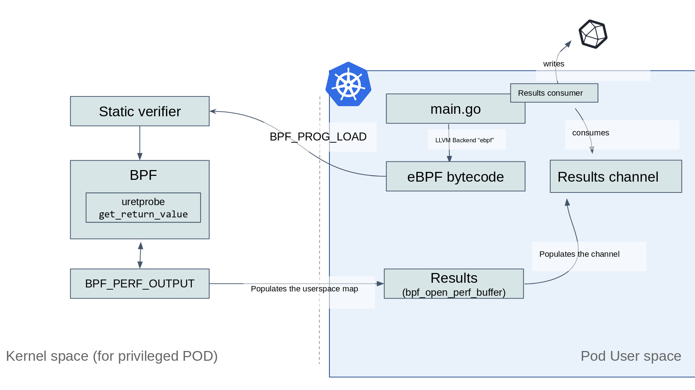

# InfluxDB eBPF Example

This project contains a program written in Go that uses [gobpf](http://github.com/iovisor/gobpf) to load an eBPF program containing an uprobe into the target system's kernel.

The eBPF program, is executed directly in kernel space and it gives back data to user space using
a BPF table that is then consumed to send the data to an InfluxDB backend where the data can be analyzed and plotted in nice graphs.

This example is based on the [bash_readline.go](https://github.com/iovisor/gobpf/blob/master/examples/bcc/bash_readline/bash_readline.go) program from the gobpf examples.

See [main.go](main.go) for more details, the source code is heavily commented so that you can understand it.

